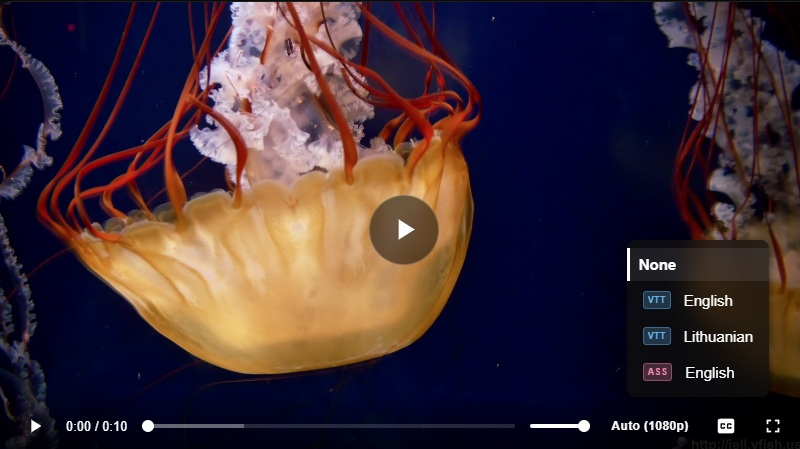
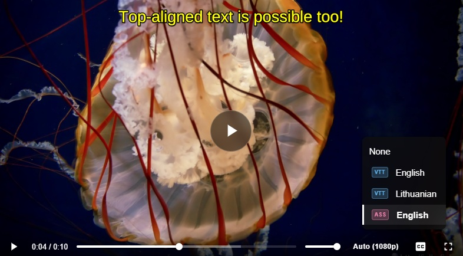
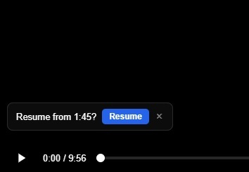

# wdPlayer

Lightweight, dependency-free HTML5 video player with adaptive streaming (HLS & DASH), quality switching, playback speed control, ASS/VTT subtitles (including embedded subtitle tracks from HLS/DASH manifests), resume playback, volume persistence, URL-encoded configuration, full responsive/mobile support, and accessibility improvements (ARIA labels, landmarks, touch targets).





## Files

```
├  📂 css
│  ├  📄 pages-min.css — Shared styles for index.html and generator.html (Minify version)
│  ├  📄 pages.css — Shared styles for index.html and generator.html
│  ├  📄 wdPlayer-min.css — Player styles (Minify version)
│  ╰  📄 wdPlayer.css — Player styles
├  📂 js
│  ├  📂 octopus — SubtitlesOctopus (lazy-loaded only when ASS is used)
│  │  ├  📂 fonts
│  │  │  ├  📄 ARIALBD.TTF
│  │  │  ├  📄 default.woff2
│  │  │  ╰  📄 NotoSansJP-Bold.ttf
│  │  ├  📄 subtitles-octopus-worker-legacy.js
│  │  ├  📄 subtitles-octopus-worker.js
│  │  ├  📄 subtitles-octopus-worker.wasm
│  │  ╰  📄 subtitles-octopus.js
│  ├  📄 dash.all-min.js — dash.js (lazy-loaded only when DASH source is used) (Minify version)
│  ├  📄 dash.all.js — dash.js (lazy-loaded only when DASH source is used)
│  ├  📄 generator-min.js — All generator logic (Minify version)
│  ├  📄 generator.js — All generator logic
│  ├  📄 hls-min.js  — hls.js (lazy-loaded only when HLS source is used) (Minify version)
│  ├  📄 hls.js  — hls.js (lazy-loaded only when HLS source is used)
│  ├  📄 wdPlayer-min.js — All player logic (IIFE, no dependencies) (Minify version)
│  ╰  📄 wdPlayer.js — All player logic (IIFE, no dependencies)
├  📂 screenShots — Example screenshot files
│  ├  📄 1.jpg
│  ├  📄 2.jpg
│  ╰  📄 3.jpg
├  📂 subtitles — Example subtitle files
│  ├  📄 subtitles.en.ass
│  ├  📄 subtitles.en.vtt
│  ╰  📄 subtitles.lt.vtt
├  📄 doc.html — Documentation
├  📄 embed.html — Standalone player shell (use this in iframes or directly)
├  📄 fav.png — FavIcon
├  📄 generator.html — Visual URL builder (no JSON required)
├  📄 index.html — Demo page with player, features, and usage docs
╰  📄 README.md — Read Me file


```

## Usage

### 1. Direct URL — single video

```
embed.html?v=https://example.com/video.mp4
```

Type is auto-detected from the file extension (`.mp4`, `.webm`, `.ogg`, `.m3u8`, `.mpd`).

---

### 2. `?sources=` param — plain JSON

Pass sources and subtitles directly as JSON. The player will encode and redirect to `?v=BASE64` automatically.

```
embed.html?sources=[{"label":"1080p","src":"https://…/video.mp4","type":"video/mp4"},
                    {"label":"720p", "src":"https://…/720.mp4",  "type":"video/mp4"}]
          &subtitles=[{"label":"English","src":"subtitles/en.vtt","type":"vtt","srclang":"en"}]
```

Or build the URL in JavaScript:

```js
const sources = [
  { label: "1080p", src: "https://…/video.mp4", type: "video/mp4" },
];
const subtitles = [
  { label: "English", src: "subtitles/en.vtt", type: "vtt", srclang: "en" },
];

const url =
  "embed.html" +
  "?sources=" +
  encodeURIComponent(JSON.stringify(sources)) +
  "&subtitles=" +
  encodeURIComponent(JSON.stringify(subtitles));
```

---

### 3. `?v=BASE64` — encoded config

Use the **URL Generator** (`generator.html`) to build a Base64-encoded URL visually, or encode manually:

```js
const cfg = {
  sources: [
    { label: "1080p", src: "https://…/1080.mp4", type: "video/mp4" },
    { label: "720p", src: "https://…/720.mp4", type: "video/mp4" },
    // Adaptive streams — quality menu populated automatically from manifest
    {
      label: "HLS",
      src: "https://…/stream.m3u8",
      type: "application/x-mpegURL",
    },
    {
      label: "DASH",
      src: "https://…/stream.mpd",
      type: "application/dash+xml",
    },
  ],
  subtitles: [
    { label: "English", src: "subtitles/en.vtt", type: "vtt", srclang: "en" },
    { label: "English", src: "subtitles/en.ass", type: "ass", srclang: "en" },
  ],
};

// Minify keys before encoding (sources→v, subtitles→u, label→l, src→s, type→t, srclang→sl)
const mini = {
  v: cfg.sources.map(({ label: l, src: s, type: t }) => ({ l, s, t })),
  u: cfg.subtitles.map(({ label: l, src: s, type: t, srclang: sl }) =>
    sl ? { l, s, t, sl } : { l, s, t },
  ),
};

// Unicode-safe Base64 encoding
const url =
  "embed.html?v=" +
  btoa(
    encodeURIComponent(JSON.stringify(mini)).replace(
      /%([0-9A-F]{2})/gi,
      (_, p1) => String.fromCharCode(parseInt(p1, 16)),
    ),
  )
    .replace(/\+/g, "-")
    .replace(/\//g, "_")
    .replace(/=+$/, "");
```

---

### 4. iFrame embed

```html
<iframe
  src="embed.html?v=BASE64"
  width="560"
  height="315"
  allowfullscreen
  style="border:none;"
>
</iframe>
```

Copy the iFrame snippet directly from the **Encoded → iFrame** tab in the generator.

---

## Adaptive Streaming

The player supports both **HLS** (`.m3u8`) and **DASH** (`.mpd`) adaptive streams via hls.js and dash.js respectively. Both libraries are lazy-loaded only when needed.

### HLS

- Detected by `.m3u8` extension or `application/x-mpegURL` / `application/vnd.apple.mpegurl` type
- Uses **hls.js** when MSE is available (Chrome, Firefox, Edge) — enables quality selection
- Falls back to native HLS on iOS Safari (no quality menu)
- **Quality menu** is populated automatically from the manifest levels
- **Multi-audio tracks** are detected and populated directly from the HLS manifest
  the interface element triggers on-demand only when alternative audio tracks are found, supporting seamless real-time language switching.
- **Subtitle tracks** embedded in the HLS manifest are loaded automatically (type badge: `HLS`); external subtitle files can still be added alongside

### DASH

- Detected by `.mpd` extension or `application/dash+xml` type
- Uses **dash.js** with ABR enabled by default
- **Quality menu** populated automatically from available bitrate representations
- **Multi-audio tracks** are parsed dynamically from the MPD manifest
  the microphone button initializes on-demand only if multiple audio streams are detected, allowing hot-swapping of language buffers mid-stream.
- **Subtitle tracks** from the MPD are loaded automatically (type badge: `DASH`); external subtitle files can still be added alongside

### Quality Menu

- **Auto** — ABR is active; the button shows the currently rendered resolution (e.g. `Auto (1080p)`)
- **Manual level** — ABR is disabled; the button shows the selected resolution (e.g. `1080p`)
- Duplicate resolutions at different bitrates are deduplicated — only the highest-bitrate entry per resolution is shown
- `Q` key cycles through levels just like the menu

---

## Subtitles

| Format | Type badge | How                      | Notes                                              |
| ------ | ---------- | ------------------------ | -------------------------------------------------- |
| VTT    | `VTT`      | Native `<track>` element | Validated with HEAD request before adding          |
| ASS    | `ASS`      | SubtitlesOctopus         | Lazy-loaded from `js/octopus/` on first use        |
| HLS    | `HLS`      | hls.js subtitle API      | Embedded tracks from HLS manifest; default is None |
| DASH   | `DASH`     | dash.js text renderer    | Embedded tracks from DASH MPD; default is None     |

When an adaptive stream provides embedded subtitle tracks (HLS or DASH), those tracks are shown in the menu and **native `<track>` elements are not listed** (to avoid duplicates). If the stream has no embedded subtitles, only the externally configured VTT/ASS files are shown.

The CC button highlights in cyan when a subtitle track is active. Clicking it opens a track-selection menu; pressing `C` cycles through all tracks and back to Off, with a brief on-screen toast confirming the change.

---

## Keyboard shortcuts

| Key                | Action                         |
| ------------------ | ------------------------------ |
| `Space` / click    | Play / Pause                   |
| `F` / double-click | Toggle fullscreen              |
| `M`                | Toggle mute                    |
| `C`                | Cycle subtitle tracks (or Off) |
| `Q`                | Cycle quality levels (or Auto) |
| `←` `→`            | Seek ±5 s                      |
| `↑` `↓`            | Volume ±10%                    |
| `,` / `.`          | Speed down / up                |
| `0` – `9`          | Seek to 0% – 90%               |
| Right-click        | Info context menu              |

Keyboard shortcut hints are shown inside button tooltips on desktop (pointer) devices. Set `TOOLTIPS_ENABLED = false` at the top of `wdPlayer.js` to disable tooltips entirely.

---

## Auto quality (multi-file sources)

When multiple plain MP4/WebM sources are provided (no adaptive stream), the player measures bandwidth via `navigator.connection.downlink` (or a timed fetch probe as fallback) and picks the best source. It re-checks every 5 seconds and reacts to `connection` change events. Manual override is available via the quality button.

If the video stalls for more than 3 seconds while in auto mode, the player immediately steps down one quality level (stall recovery).

---

## Playback speed

A **speed button** (labelled `1×`) sits in the controls bar. Clicking it opens a menu with options: `0.5×`, `0.75×`, Normal (`1×`), `1.25×`, `1.5×`, `2×`. The button label updates to reflect the active rate.

Keyboard shortcuts `,` (slower) and `.` (faster) cycle through the same rates and show a brief on-screen toast.

---

## Volume persistence

Volume level and mute state are saved to `localStorage` and restored automatically on the next visit.

---

## Buffering

- `preload="auto"` — the browser buffers ahead of the playhead
- Spinner is **debounced** (300 ms delay) so it does not flash during quick seeks
- **Stall recovery** — if buffering persists for 3 s in auto mode (multi-file), the player steps down one quality level immediately

---

## Resume playback

The player automatically saves the current position to `localStorage` every 5 seconds (keyed by the `?v=` param). On the next visit, if a saved position is found that is more than 5 seconds in and not within 10 seconds of the end, a **"Resume from X:XX?"** toast appears with two options:

- **Resume** — seeks to the saved position
- **×** — dismisses and clears the saved position

On desktop the toast appears in the bottom-left corner. On mobile (≤ 480 px) it moves to the top of the player to avoid overlapping the play button and the two-row controls bar. The toast disappears automatically when playback starts. The saved position is cleared when the video finishes.

---

## Video Watermark (Logo)

The player features a custom text watermark (logo) that acts as a brand overlay during playback. The element is attached directly to the player wrapper, ensuring it remains visible and correctly positioned across all browsers.

- **Animation** — The logo remains completely hidden until playback starts. Once the user hits play, it triggers.

- **Responsiveness & Bounds** — The logo is locked to the top-right corner (15px padding) of the active video frame. By binding the player wrapper to a strict aspect ratio, the text never leaks outside the actual video boundaries into the empty black bars (letterboxing).

---

## Responsive / Mobile

The player and both pages adapt to all screen sizes:

| Breakpoint | Changes                                                                                                                                                              |
| ---------- | -------------------------------------------------------------------------------------------------------------------------------------------------------------------- |
| ≤ 768 px   | Larger touch targets (44 px min), slightly smaller gaps                                                                                                              |
| ≤ 480 px   | Controls switch to a **two-row layout** — progress bar full-width on top, buttons on the bottom row; mute button and volume slider hidden; quality button auto-sized |

Additional touch optimisations applied at all sizes:

- `touch-action: manipulation` on every interactive element (no 300 ms tap delay)
- All `:hover` styles are wrapped in `@media (hover: hover)` so they never get "stuck" after a tap on touch screens
- Thumbnail tooltip hidden on touch (swipe seek isn't possible anyway)
- Resume toast repositioned to the top of the player on mobile
- Seek bar and quality button have a **44 px minimum touch target** height (visual track stays 4 px via `background-size`)

---

## Accessibility

- All icon-only buttons (`play`, `pause`, `mute`, `fullscreen`, `CC`) carry `aria-label` attributes that update dynamically with the current state (e.g. `"Play"` / `"Pause"`, `"Mute"` / `"Unmute"`, `"Enter fullscreen"` / `"Exit fullscreen"`)
- The dismiss button on the resume toast uses `aria-label="Dismiss"` instead of the bare `×` character
- Range inputs (`progressBar`, `volumeSlider`) carry `aria-label="Seek"` and `aria-label="Volume"` respectively
- All pages wrap their main content in a `<main>` landmark element

---

## No server required

All configuration is self-contained in the URL. Works in incognito, on other devices, or shared as a plain link.
